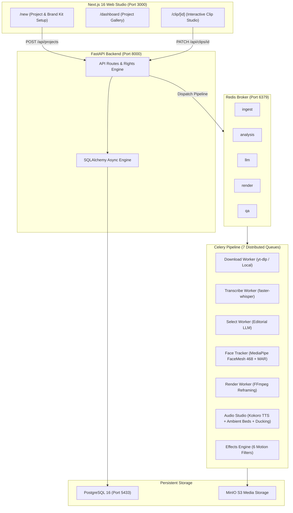

<div align="center">

# 🎬 ClipForge AI v2

### *Transform Long-Form Videos into High-Impact Viral Shorts & Reels — 100% Locally & Privately.*

[](https://www.python.org/downloads/)
[](https://nextjs.org/)
[](https://fastapi.tiangolo.com/)
[](https://docs.celeryq.dev/)
[](https://github.com/hexgrad/kokoro)
[](https://developers.google.com/mediapipe)
[](https://ffmpeg.org/)
[](LICENSE)

[Features](#-features) • [Quick Start](#-quick-start) • [Architecture](#-architecture) • [Workflow](#-workflow) • [Studio Editor](#-clip-studio-editor) • [Contributing](#-contributing)

---

</div>

## 🌟 Overview

**ClipForge AI** is an open-source, production-grade video clipping and repurposing suite. It ingests long-form YouTube videos or local footage, identifies the most compelling highlights with LLM-guided editorial scoring, auto-reframes speakers using **MediaPipe face-tracking**, burns in dynamic word-bounce **Karaoke subtitles**, applies cinematic motion/texture effects, and mixes realistic **offline AI narration** (Kokoro TTS) with dynamic audio ducking.

Everything runs on your local machine with **zero cloud subscription lock-in** and **zero data leaving your hardware**.

---

## ⚡ Features

### 👤 1. Active-Speaker Face Detection & Precision 9:16 Smart Reframing
* **MediaPipe FaceMesh (468 Landmarks):** Active speaker identification analyzing lip movement dynamics (Mouth Aspect Ratio variance) correlated with word-level transcript speech intervals. Seamlessly tracks who is actually talking in multi-person scenes (panel shows, interviews, podcasts) rather than locking onto the nearest or largest face.
* **BlazeFace Fast Detection:** Multi-face tracking sampling up to 6 simultaneous faces with low-resolution acceleration.
* **Precision Face-Centering Formula:** Centers the speaker's face directly in the 9:16 crop window (`x_offset = max(0, min(src_w - crop_w, face_center_x - crop_w / 2))`) with exponential smoothing ($\alpha = 0.25$) to eliminate jittery cuts.
* **Adaptive Framing Modes:** Choose between **Face Track 9:16**, **Blurred Ambient Background**, or **Center Crop**.

### 🎯 2. Editorial Discovery & Transformation Scoring
* **AI Highlight Detection:** Uses local or cloud LLMs (Ollama, LM Studio, OpenAI, Claude, Gemini) to score moments based on *Hook Quality*, *Standalone Clarity*, and *Narrative Flow*.
* **Canonical Editorial Metrics:** Ranks clips using `editorial_potential` ($50\%$) and `transformation_score` ($50\%$).
* **6 Editorial Transformation Templates:** *Explainer*, *Commentary*, *News / Context*, *Reaction / PiP*, *Quote Breakdown*, and *Campaign Promo*.
* **Multi-Batch Reclipping Engine:** Re-clip with custom counts (e.g., 20 clips), duration ranges, and aspect ratios from existing transcripts without re-transcribing, using collision-free sequential indexing (`clip_6`, `clip_7`...).

### 🎙️ 3. Audio Studio, Offline Kokoro TTS & Ambient Music Beds
* **Zero-Cloud Local Speech:** Integrated `kokoro-onnx` generating human-grade narration in $\approx 0.5\text{s}$ on CPU.
* **7 Studio Voice Personas:** Bella, Adam, Emma, George, Sarah, Michael, Nicole.
* **Royalty-Free Ambient Music Library:** Mastered polyphonic background tracks (`ambient_focus`, `lofi_beats`, `upbeat_tech`, `epic_cinematic`) mastered to $-16\text{ LUFS}$.
* **Dynamic Sidechain Ducking:** Automatically attenuates background audio by $-12\text{ dB}$ during speech with smooth fade recovery during pauses.
* **EBU R128 Mastering:** Integrated dual-pass loudness normalization targeting broadcast standard ($-14.0\text{ LUFS}$).

### 💬 4. Subtitle Typography & Karaoke Presets
* **Word-Level Highlighting:** Deterministic ASS subtitle rendering with yellow bounce karaoke animation.
* **Preset Styles:** *⚡ Bold Karaoke*, *✨ Minimal White*, *📺 Clean Subtitle*, or *🚫 Raw Video*.

### 🎨 5. Motion & Color Texture Effects Stack
* **6 Hardware-Accelerated Filters:**
  * 🎞️ **Film Grain:** Dynamic 35mm organic grain.
  * 🎬 **Cinematic Vignette:** Soft peripheral shadow.
  * 🔍 **Push-In Zoom:** Keyframed focus punch.
  * 📳 **Handheld Camera Shake:** Organic documentary motion.
  * 🌈 **RGB Glitch:** Native channel split with unshifted green channel for maximum text readability.
  * 📼 **VHS Retro:** Nostalgic analog color saturation and line jitter.

### ⚖️ 6. Native Browser File Explorer & Direct Local Export
* **Browser-Native Windows Explorer:** Instant HTML5 `<input type="file">` and `<input type="file" webkitdirectory>` folder pickers with zero focus locking or thread deadlocks, plus real-time file size and video count badges.
* **Direct Silent Local Export:** 1-click export saving directly to dedicated project subfolders (`D:\Export\Project_Title\`) with numbered MP4s (`01_Clip.mp4`), thumbnails, and JSON manifests without browser popups.
* **Rights Basis Tracking:** Categorizes projects into *Owned*, *Licensed*, *Permitted*, *Commentary/Fair-Use*, or *Unconfirmed*.
* **Draft-07 Render Manifests:** Automatically produces verifiable JSON manifests recording source provenance, transformational score, and effect layers.

---

## 🚀 Quick Start

### Prerequisites
* **Git**
* **Docker Desktop** (or Docker Engine on Linux)
* **Python 3.11+** (managed via [`uv`](https://docs.astral.sh/uv/))
* **Node.js 18+** & [`pnpm`](https://pnpm.io/)
* **FFmpeg 6.0+** (in your system PATH)

---

### Installation & Launch

#### 1. Clone the Repository
```bash
git clone https://github.com/ZAiRO26/YT-Clip.git
cd YT-Clip
```

#### 2. Install Dependencies
```bash
# Install frontend packages
pnpm install

# Install Python environment & tools
uv sync
```

#### 3. 1-Click Studio Launch

**On Windows:**
```cmd
start.bat
```

**On macOS / Linux:**
```bash
chmod +x start.sh
./start.sh
```

---

## 🌐 Studio Dashboard & URLs

Once started, the services will be available at:

| Service | URL | Description |
| :--- | :--- | :--- |
| **Web Studio** | [http://localhost:3000](http://localhost:3000) | Next.js 16 Dark-Mode Video Editing Studio |
| **REST API** | [http://localhost:8000/docs](http://localhost:8000/docs) | FastAPI Swagger UI & Endpoints |
| **MinIO S3 UI** | [http://localhost:9001](http://localhost:9001) | Media Object Browser (`minioadmin` / `minioadmin`) |
| **PostgreSQL** | `localhost:5433` | Database (`clipforge` / `postgres`) |
| **Redis** | `localhost:6379` | Celery Task Broker |

---

## 🏗️ Architecture Overview



---

## 🛠️ Tech Stack

* **Frontend:** Next.js 16 (App Router, Turbopack), Tailwind CSS, Lucide Icons, TypeScript, HTML5 Native File/Directory Explorer (`webkitdirectory`).
* **Backend:** FastAPI, Pydantic v2, SQLAlchemy 2.0 (Asyncpg + Psycopg2), Alembic.
* **Orchestration:** Celery 5.4, Redis 7.
* **Speech & Audio:** Kokoro ONNX Runtime (`kokoro-onnx`), Faster-Whisper, Polyphonic Synthesizer Engine, FFmpeg `sidechaincompress` & `loudnorm`.
* **Vision & Motion:** MediaPipe FaceMesh (468 facial landmarks) + BlazeFace detection, PySceneDetect, FFmpeg filter complex (`rgbashift`, `noise`, `vignette`, `zoompan`).

---

## 🧪 Running Tests

The project includes an automated test suite verifying all audio ducking calculations, face detection smoothing, video effect filters, and schema alignment:

```bash
# Run all Python unit and integration tests
uv run pytest packages/python-core/tests

# Run frontend production build & TypeScript validation
pnpm --filter @clipforge/web build
```

---

## 📄 License

This project is licensed under the [MIT License](LICENSE).

---

<div align="center">
Built with ❤️ for creators, educators, and open-source video enthusiasts.
</div>
