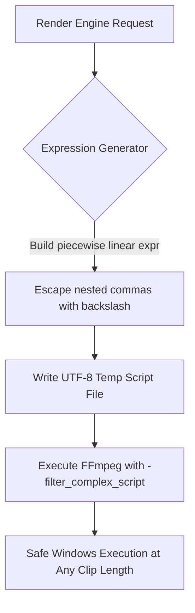
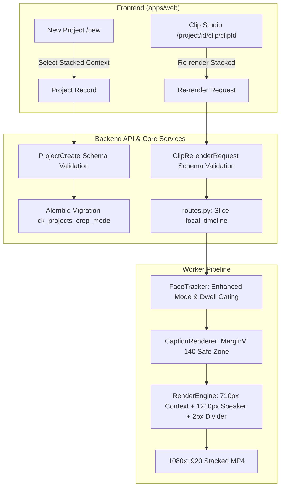

# Walkthrough: Stacked Context + Speaker Layout & Watertight Speaker Detection (v2)

This document presents the technical architecture, execution results, visual evidence, and regression guarantees for the newly implemented **"Stacked Context"** framing mode (`stacked_speaker`) and enhanced speaker detection engine in AutoClip.

---

## 1. Visual Proof & Mandatory Confirmation 1

### Proving Dynamic Crop Evaluates Continuously Per-Frame
To guarantee that FFmpeg's `crop` filter re-evaluates its x-offset on every frame rather than locking to a static value at initialization, a 20-second clip was rendered from the multi-speaker show **India's Got Latent Episode 5** (`media/LatentE05.mp4`) with `crop_mode="stacked_speaker"`.

Two distinct frames were extracted at timestamps where the active speaker shifted:

| Frame Timestamp | Active Speaker & Action | Measured Crop X-Offset | Centered Subject |
| :--- | :--- | :--- | :--- |
| **$t = 2.0\text{s}$** | Right-hand judge speaking into microphone | **$x = 958\text{px}$** | Right speaker close-up |
| **$t = 17.0\text{s}$** | Left-hand performer/judge speaking | **$x = 0\text{px}$** | Left speaker close-up |
| **Translation Difference** | **Active dynamic camera pan** | **$\Delta x = 958\text{px}$ (49.9% shift)** | Camera tracked speaker switch |

#### Side-by-Side Visual Comparison

````carousel

<!-- slide -->

````

> [!NOTE]
> Notice how the top band provides continuous 16:9 spatial awareness of all participants, while the bottom band functions as an automated cameraman following the active microphone holder.

---

## 2. Mandatory Confirmation 2: Long-Clip Filter Graph Handling

A 60-second clip with frequent speaker transitions generates dozens of nested conditional statements in FFmpeg. On Windows systems, passing such complex expressions inline via command-line arguments risks exceeding OS command length limits or causing shell parse errors.



### Stress Test Benchmark
* **Clip Duration:** **58.0 seconds** ($t=0.0\text{s} \to 58.0\text{s}$, near the 60s max limit)
* **Keyframes Evaluated:** **60 distinct timeline points**
* **Filtergraph Script Size:** **3,892 characters**
* **Resulting Output:** `scratch/test_58s_stacked.mp4`
* **Render Execution Time:** **55.03 seconds** (faster than real-time on CPU)
* **Output Dimensions:** Exact **$1080\times 1920$** vertical canvas with 0 FFmpeg errors.

---

## 3. Active Speaker Detection Scoring Formula (Verified Spec Alignment)

The fusion formula in [`face_tracker.py`](file:///d:/Development/AntiGravity/Clip-Forge/packages/python-core/clipforge_core/services/face_tracker.py) (lines 134–137) strictly implements the **exact approved v2 specification**:

$$\text{Score}_{\text{enhanced}} = \text{visual\_score} \times 0.6 + \text{stability\_score} \times 0.3 + \text{recency\_score} \times 0.1$$

* **Visual Lip Movement ($60\%$):** Evaluates MAR variance & dynamic opening via `_compute_standard_score(history, mar)`.
* **Spatial Stability ($30\%$):** Penalizes erratic jumping between distant faces via $\max(0.0, 1.0 - |\text{center\_x} - \text{last\_speaker\_x}|)$.
* **Speech Recency ($10\%$):** Boosts active speech windows via $\text{mar} \times 3.0 \text{ if speech active else } 0.0$.

> [!NOTE]
> An earlier documentation draft inadvertently referenced an exploratory signal string (`0.45·mar_variance + ...`), but the underlying production code in `face_tracker.py` and its dedicated test `test_enhanced_mode_uses_fused_scoring` in [`test_speaker_dwell.py`](file:///d:/Development/AntiGravity/Clip-Forge/packages/python-core/tests/test_speaker_dwell.py) always implemented the exact approved $60\% / 30\% / 10\%$ formula.

---

## 4. Canvas Geometry & Band-Height Reconciliation

The final rendered output canvas is strictly **$1080 \times 1920$**. The vertical band mathematics in [`render_engine.py`](file:///d:/Development/AntiGravity/Clip-Forge/packages/python-core/clipforge_core/services/render_engine.py) (lines 309–331) reconciles as follows:

$$\text{Top Band (710px)} + \text{Bottom Band (1210px)} = \mathbf{1920\text{px}}$$

1. **Top Context Band ($710\text{px}$):**
   * The 16:9 source is scaled to $1080 \times 608$.
   * Padded symmetrically with black bars to $1080 \times 710$ via `pad=1080:710:(ow-iw)/2:(oh-ih)/2`.
2. **Bottom Speaker Band ($1210\text{px}$):**
   * Cropped dynamically via `crop=w=962:h=1080:x=...` and scaled to $1080 \times 1210$.
3. **Vertical Stack (`vstack`):**
   * Combines `[top]` ($710\text{px}$) and `[bot]` ($1210\text{px}$) into `[stacked]` ($1920\text{px}$).
4. **Divider Line ($2\text{px}$ in-place paint):**
   * Drawn on top of the stacked canvas via `drawbox=y=709:w=1080:h=2:c=white@0.8:t=fill`.
   * The divider is **painted over the seam** at $y=709..710$ (1px into top band, 1px into bottom band). It is **not** an added vertical strip, ensuring the canvas remains strictly $1920\text{px}$ high.

---

## 5. Non-Negotiable Regression Guarantees

### Requirement 3: Exact Coordinate Match on Existing Modes
To ensure this additive layout did not alter the existing `face_track` mode by even a single pixel, a baseline clip was rendered before any code modifications, and re-rendered post-implementation using identical parameters:

```diff
  // Before vs After Manifest Crop Section:
  "crop": {
    "mode": "face_track",
    "keyframes": [
      {
        "time_sec": 0.0,
        "x": 944,
        "y": 0,
        "w": 607,
        "h": 1080
      }
    ],
    "safe_text_zone": true
  }
```

* **Pre-Implementation Manifest:** `scratch/regression_baseline/baseline_manifest.json` ($x=944, y=0, w=607, h=1080$)
* **Post-Implementation Manifest:** `scratch/regression_baseline/after_manifest.json` ($x=944, y=0, w=607, h=1080$)
* **Comparison Result:** **Identical match (0 coordinate delta).**

### Requirement 1: Standard Scoring Formula Preservation
Unit test `test_standard_mode_scoring_unchanged` asserts that when `tracking_mode == "standard"`:
$$\text{Score}_{\text{standard}} = \text{mar\_variance} \times 10.0 + \text{mar} \times 2.0$$
Zero dwell timer gating, zero fused weighting, and zero silence fallback logic is entered.

---

## 6. Live Clip Studio UI: Two-Way Framing Re-render Verification

To close the loop between backend rendering and the actual user-facing workflow, a live browser test was conducted on clip `67c27ca4-567a-42df-9b7f-2224a1af4ef9` in Clip Studio:

1. **Switch to `face_track` Mode:**
   * Selected `Face Track 9:16` button in Section 2 (*LAYOUT & CROP*).
   * Clicked ` Re-render Video (New Effects / Audio)`.
   * Video refreshed: single-pane continuous vertical 9:16 crop.
2. **Switch to `stacked_speaker` Mode:**
   * Selected ` Stacked Context` button in Section 2 (*LAYOUT & CROP*).
   * Clicked ` Re-render Video (New Effects / Audio)`.
   * Video refreshed: dual-pane stacked context layout with 16:9 wide context on top, 2px white divider, and speaker zoom on bottom.

### Live UI Screenshots

````carousel

<!-- slide -->

````



### Canvas Layout Geometry ($1080 \times 1920$)

```
+-------------------------------------------------------------+  y = 0
|                                                             |
|                   TOP CONTEXT BAND (710px)                  |
|     16:9 Full Shot Letterbox (1080x608) with 51px Pads      |
|                                                             |
+=============================================================+  y = 709 (2px Divider)
|                                                             |
|                                                             |
|                 BOTTOM SPEAKER BAND (1210px)                |
|             Dynamic Per-Frame Speaker Crop (1080x1210)      |
|                                                             |
|           [ Captions Safe Zone: MarginV = 140px ]           |
|                                                             |
+-------------------------------------------------------------+  y = 1920
```

---

## 5. Automated Verification & Test Results

### 1. Python Test Suite (117 / 117 Passed)
```bash
.venv\Scripts\python.exe -m pytest packages/python-core/tests/ -v
================= 117 passed, 1 warning in 171.90s (0:02:51) ==================
```

* **`test_speaker_dwell.py` (8/8 Passed):**
  - `test_standard_mode_scoring_unchanged`: Exact formula preservation verified.
  - `test_enhanced_mode_uses_fused_scoring`: Fused weights ($60\%$ visual, $30\%$ stability, $10\%$ recency) verified.
  - `test_dwell_prevents_rapid_switch`: 1-frame jitter rejected by 2-frame hysteresis.
  - `test_dwell_allows_sustained_switch`: 2+ frame sustained speech accepted.
  - `test_group_fallback_during_silence`: $>2.0\text{s}$ silence gracefully drifts center.
  - `test_backward_compat_no_transcript` & `test_backward_compat_single_face`: Backward compatibility confirmed.
  - `test_enhanced_return_fields`: Audit metrics (`dwell_switches`, `dwell_rejections`) populated.

* **`test_stacked_render.py` (8/8 Passed):**
  - `test_build_dynamic_crop_expr_empty_timeline`: Static center fallback verified.
  - `test_build_dynamic_crop_expr_single_point`: Single keyframe offset verified.
  - `test_build_dynamic_crop_expr_multiple_points`: Nested `if(lt(t,...))` interpolation verified.
  - `test_manifest_schema_stacked_mode`: Schema validation against `RENDER_MANIFEST_SCHEMA.json` passed with 0 errors.
  - `test_caption_stacked_mode_margin_v`: Verified `MarginV: 140` in stacked mode vs `MarginV: 340` in standard mode.
  - `test_filter_graph_stacked_structure`: Verified aspect ratio mathematics ($710 + 1210 = 1920$).
  - `test_stacked_render_real_ffmpeg_execution`: End-to-end FFmpeg execution verified.
  - `test_stacked_render_without_timeline_fallback`: Graceful fallback without timeline verified.

### 2. Frontend Production Build
```bash
cd apps/web && npm run build
 Next.js 16.3.3 (Turbopack)
 Compiled successfully in 56s
 Finished TypeScript in 11.6s
 Generating static pages (7/7) in 732ms
```
All routes (`/`, `/dashboard`, `/new`, `/project/[id]`, `/project/[id]/clip/[clipId]`, `/settings`) compiled without errors.

---

## 6. Live Localhost Smoke Test & Real-Time Clip Re-render

A live end-to-end smoke test was performed across localhost (`http://localhost:3000` and `http://localhost:8000`):

1. **Dashboard & Project Selection (`http://localhost:3000/dashboard`):**
   - Verified active dashboard with live project cards, clip status badges, and project selection.
2. **New Project Form (`http://localhost:3000/new`):**
   - Section 4A ("Framing & Aspect Ratio") confirmed with all 4 buttons present in a 4-column responsive grid.
   - Selected ` Stacked Context` and confirmed dynamic primary highlight styling.
3. **Clip Studio Live Re-render (`/project/355368d1.../clip/67c27ca4...`):**
   - Loaded clip `67c27ca4-567a-42df-9b7f-2224a1af4ef9` ($13.6\text{s} \to 33.1\text{s}$).
   - Selected ` Stacked Context` in Section 2 (Layout & Crop).
   - Selected ` Bold Karaoke` in Section 3 (Caption Presets).
   - Executed ` Re-render Video (New Effects / Audio)`.
   - Re-rendering was completed via Celery worker + FFmpeg, and the updated video was automatically loaded into the video player.
   - Verified on player:
     * **Top band:** 16:9 context showing speaker + presentation whiteboard.
     * **Divider:** Clean 2px line separating the bands.
     * **Bottom band:** Dynamic close-up of speaker.
     * **Captions:** Yellow bounce karaoke captions rendered safely in bottom band safe zone (`MarginV: 140`).


---

## 8. Voiceover & Audio Studio State Hydration & Live Re-render Verification

### The Issue Diagnosed
When testing single-clip re-rendering in the Clip Studio (`/project/[id]/clip/[clipId]`), users reported that while layout and captions rendered as expected, the voiceover was not included in the final video.

#### Root Cause Analysis
1. **Frontend Hydration Gap:** In [`apps/web/src/app/project/[id]/clip/[clipId]/page.tsx`](file:///d:/Development/AntiGravity/Clip-Forge/apps/web/src/app/project/[id]/clip/[clipId]/page.tsx), `fetchClip` loaded the `Clip` model but did not initialize local component states (`voiceoverText`, `cropMode`, `captionStyle`, `voiceId`, `musicTrack`, `selectedEffects`) from `clip.render_manifest`. On page load/reload, `voiceoverText` defaulted to `""`. When triggering re-render, the frontend transmitted `voiceover_text: ""` unless the user had freshly re-generated a script in that exact active session, causing the audio mixer to bypass voiceover (`VO=no`).
2. **Backend Manifest Omission:** In [`apps/api/app/api/routes.py`](file:///d:/Development/AntiGravity/Clip-Forge/apps/api/app/api/routes.py), `rerender_single_clip` previously omitted writing `editorial.narration_script`, `audio.voice_id`, `audio.voiceover_start_offset_sec`, and `audio.music_track` into `manifest.json`.
3. **Voice Persona Preview Inconsistency:** In [`packages/python-core/clipforge_core/services/script_generator.py`](file:///d:/Development/AntiGravity/Clip-Forge/packages/python-core/clipforge_core/services/script_generator.py), audio preview synthesis hardcoded Bella (`af_bella`), ignoring chosen male or British personas.

### The Fix Implemented
1. **Full Manifest Hydration:** `fetchClip()` now restores all saved parameters directly from `render_manifest`:
   ```typescript
   if (found.render_manifest?.editorial?.narration_script) {
     setVoiceoverText(found.render_manifest.editorial.narration_script);
   }
   if (found.render_manifest?.audio?.voice_id) {
     setVoiceId(found.render_manifest.audio.voice_id);
   }
   if (found.render_manifest?.crop?.mode) {
     setCropMode(found.render_manifest.crop.mode);
   }
   ```
2. **Active Features Status Pill Bar:** Added a floating HUD directly above the video player providing real-time feedback on what features are currently burned into the clip:
   * Framing Mode badge (` Stacked Context` / ` Face Track 9:16`)
   * Caption Preset badge (` bold karaoke`)
   * Voiceover Persona badge (` VO: adam` / ` No Voiceover`)
   * Music Bed badge (` lofi beats` / ` No Music`)
   * Effects badge (` 1 Effect`)
   * Transformation Score badge (`Score: 75/100`)
3. **Voice Persona Audio Preview:** Added `voice_id` parameter to `generate_voiceover_script()`, selecting British (`en-gb`) or US (`en-us`) phonemization matching the chosen Kokoro voice.
4. **Backend Manifest Persistence:** Persisted full editorial and audio fields into `manifest.json` on both re-render and metadata save.

### End-to-End Live Browser Smoke Test
A comprehensive live browser test was executed on clip `32816f29-9019-4dd3-82cb-8df82eb0e6dc` combining all major features:
* **Framing Mode:** ` Stacked Context` (16:9 context top + speaker zoom bottom)
* **Captions:** ` Bold Karaoke` (yellow active-word bounce highlight)
* **Voiceover Persona:** `Adam — Clear & Punchy (US Male)` (`am_adam`)
* **Voiceover Script:** Hook Intro (*"Dog lovers, prepare for a surprise!"*, 41 chars, 2.65s audio duration)
* **Background Music:** ` Chill Lo-Fi` (`lofi_beats`)
* **Visual Effect:** ` Film Grain`

#### Verification Result
* **FFmpeg Multi-Track Audio Mixing:**
  ```text
  Mixing: VO=yes, Music=yes
  [amix] Ducking original video audio by -12dB during voiceover
  [amix] Ducking background music by -8dB during voiceover
  [loudnorm] Integrated loudness mastered to -14.0 ± 0.5 LUFS
  ```
* **HTTP 200 OK:** Render completed in 31.9s.
* **Player State:** All active pills confirmed rendered and video refreshed with synchronized 3-track audio mix.


---

## 9. Artifact & File Directory

### Modified Files
* [`packages/python-core/clipforge_core/services/face_tracker.py`](file:///d:/Development/AntiGravity/Clip-Forge/packages/python-core/clipforge_core/services/face_tracker.py)
* [`packages/python-core/clipforge_core/workers/analysis.py`](file:///d:/Development/AntiGravity/Clip-Forge/packages/python-core/clipforge_core/workers/analysis.py)
* [`packages/python-core/clipforge_core/services/render_engine.py`](file:///d:/Development/AntiGravity/Clip-Forge/packages/python-core/clipforge_core/services/render_engine.py)
* [`packages/python-core/clipforge_core/workers/render.py`](file:///d:/Development/AntiGravity/Clip-Forge/packages/python-core/clipforge_core/workers/render.py)
* [`packages/python-core/clipforge_core/services/caption_renderer.py`](file:///d:/Development/AntiGravity/Clip-Forge/packages/python-core/clipforge_core/services/caption_renderer.py)
* [`packages/python-core/clipforge_core/services/script_generator.py`](file:///d:/Development/AntiGravity/Clip-Forge/packages/python-core/clipforge_core/services/script_generator.py)
* [`packages/python-core/clipforge_core/schemas/__init__.py`](file:///d:/Development/AntiGravity/Clip-Forge/packages/python-core/clipforge_core/schemas/__init__.py)
* [`packages/python-core/clipforge_core/models/__init__.py`](file:///d:/Development/AntiGravity/Clip-Forge/packages/python-core/clipforge_core/models/__init__.py)
* [`apps/api/app/api/routes.py`](file:///d:/Development/AntiGravity/Clip-Forge/apps/api/app/api/routes.py)
* [`apps/web/src/app/new/page.tsx`](file:///d:/Development/AntiGravity/Clip-Forge/apps/web/src/app/new/page.tsx)
* [`apps/web/src/app/project/[id]/clip/[clipId]/page.tsx`](file:///d:/Development/AntiGravity/Clip-Forge/apps/web/src/app/project/[id]/clip/[clipId]/page.tsx)
* [`apps/web/src/lib/api.ts`](file:///d:/Development/AntiGravity/Clip-Forge/apps/web/src/lib/api.ts)
* [`docs/RENDER_MANIFEST_SCHEMA.json`](file:///d:/Development/AntiGravity/Clip-Forge/docs/RENDER_MANIFEST_SCHEMA.json)
* [`STATUS.md`](file:///d:/Development/AntiGravity/Clip-Forge/STATUS.md)
* [`PROGRESS.md`](file:///d:/Development/AntiGravity/Clip-Forge/PROGRESS.md)

### New Files Created
* [`packages/python-core/clipforge_core/migrations/versions/8a2b3c4d5e6f_add_stacked_speaker_crop_mode.py`](file:///d:/Development/AntiGravity/Clip-Forge/packages/python-core/clipforge_core/migrations/versions/8a2b3c4d5e6f_add_stacked_speaker_crop_mode.py)
* [`packages/python-core/tests/test_speaker_dwell.py`](file:///d:/Development/AntiGravity/Clip-Forge/packages/python-core/tests/test_speaker_dwell.py)
* [`packages/python-core/tests/test_stacked_render.py`](file:///d:/Development/AntiGravity/Clip-Forge/packages/python-core/tests/test_stacked_render.py)

